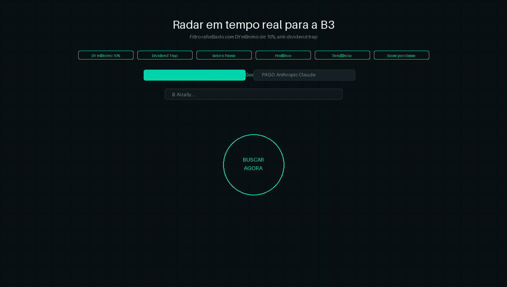

# 📡 Radar B3 — Oportunidades de Dividendos em Tempo Real

Uma aplicação web que usa **Inteligência Artificial** para identificar automaticamente as melhores oportunidades de dividendos na Bolsa de Valores brasileira (B3), com foco em perfil conservador e proteção contra *dividend trap*.




---

## ✨ O que faz

Com um único clique em **BUSCAR AGORA**, a IA analisa o mercado e retorna:

- **4 Ações** com DY ≥ 10%, de setores distintos, com filtros anti-dividend trap
- **4 FIIs** com DY ≥ 10%, de segmentos distintos, com análise de vacância e tipo de contrato

Cada resultado traz: preço, P/L, ROE, DY, margem líquida, EBITDA, dívida/EBITDA, payout, risco de dividend trap, histórico e tendência de dividendos, comparativo setorial, score de qualidade e tese de investimento.

---

## 🧠 Como funciona

```
[Usuário clica em Buscar]
        ↓
[React chama a API de IA diretamente do browser]
        ↓
[IA analisa dados reais da B3 com a data atual]
        ↓
[Resposta em JSON estruturado]
        ↓
[Cards renderizados com score, métricas e tese]
```

A aplicação é **100% frontend** — não há servidor próprio. As chamadas à IA são feitas diretamente do browser do usuário, usando a chave de API informada pelo próprio usuário na interface.

---

## 🔑 Provedores de IA suportados

| Provedor | Modelo | Custo | Como obter a chave |
|---|---|---|---|
| **Google Gemini** | gemini-2.5-flash | Gratuito (com limites) | [aistudio.google.com](https://aistudio.google.com) |
| **Anthropic Claude** | claude-sonnet-4-5 | Pago | [console.anthropic.com](https://console.anthropic.com) |

A chave é inserida diretamente na interface e **nunca é armazenada** — fica apenas na memória do React enquanto a página estiver aberta.

---

## 🛡️ Critérios de seleção (perfil conservador)

**Ações**
- DY ≥ 10%
- P/VP < 1,5
- P/L < 15
- ROE ≥ 12%
- Payout < 90%
- Dívida/EBITDA < 3,0
- Mínimo 3 setores diferentes

**FIIs**
- DY ≥ 10%
- P/VP < 1,2
- Vacância < 12%
- Preferência por contratos atípicos
- Mínimo 3 segmentos diferentes

---

## 🚀 Rodando localmente

**Pré-requisitos:** Node.js 18+

```bash
# Clone o repositório
git clone https://github.com/Willia-Developer/radar-b3.git
cd radar-b3/frontend

# Instale as dependências
npm install

# Suba o servidor de desenvolvimento
npm run dev
```

Acesse `http://localhost:5173`, escolha o provedor (Gemini recomendado), insira sua chave e clique em **BUSCAR AGORA**.

---

## 🏗️ Build para produção

```bash
npm run build
# ou no Windows (evita erro de permissão no .htaccess):
npx vite build --emptyOutDir false
```

Os arquivos ficam em `dist/`. Copie o conteúdo para o `public_html` do seu servidor (Hostinger, etc.).

---

## 📁 Estrutura do projeto

```
frontend/
├── public/
│   └── .htaccess          # Configurações Apache (SPA routing, cache, segurança)
├── src/
│   ├── App.jsx            # Componente principal + chamadas às APIs de IA
│   └── styles.css         # Layout responsivo (4 colunas → 2 → 1)
├── index.html
├── vite.config.js
└── package.json
```

---

## 🖥️ Deploy no Hostinger

1. Faça o build: `npx vite build --emptyOutDir false`
2. Acesse o **File Manager** do Hostinger
3. Vá em `public_html/`
4. Faça upload de **todo o conteúdo** da pasta `dist/` (não a pasta em si)
5. O `.htaccess` já está configurado para SPA routing e cache

---

## 🎨 Tech stack

- **React 18** + **Vite 5** — SPA sem roteamento, bundle mínimo
- **DM Mono** + **Syne** (Google Fonts) — tipografia terminal/futurista
- **CSS puro** — sem frameworks de UI, grid responsivo nativo
- **Google Gemini API** / **Anthropic API** — chamadas diretas do browser

---

## ⚠️ Aviso importante

> Os dados exibidos são gerados por IA com base em informações de mercado disponíveis na data da consulta. **Não constituem recomendação de investimento.** Sempre consulte um profissional habilitado antes de tomar decisões financeiras.

---

## 📄 Licença

MIT — livre para usar, modificar e distribuir.
